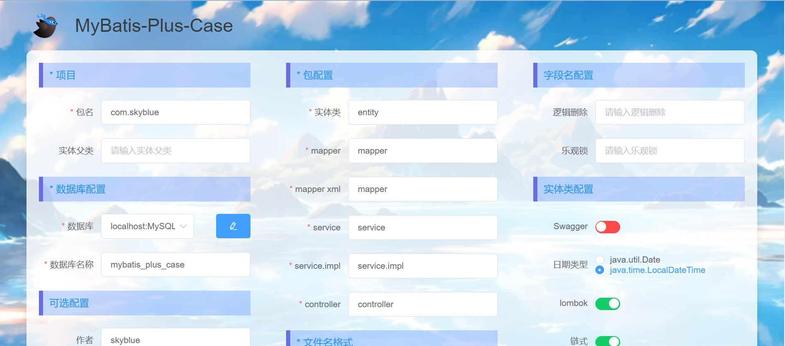
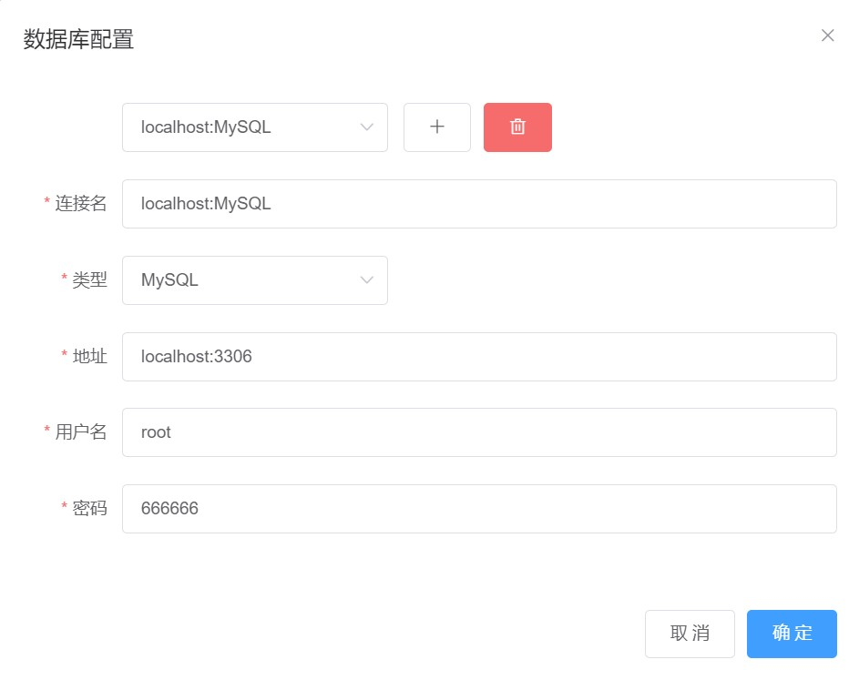

# MyBatis-Plus-Case

## 1. 项目简介

MyBatis-Plus代码生成器，学习使用，后端模仿[mybatis-plus-code-generator](https://github.com/fengwenyi/mybatis-plus-code-generator)项目，前端自己使用Vue和Element重新编写了一遍，优化了前端页面以及交互逻辑。用于生成MyBatis-Plus基本代码框架，具体内容参考mybatis-plus-code-generator项目

## 2. 项目演示






## 3. 项目运行

拉取代码

```bash
git clone git@github.com:zhangb-top/MyBatis-Plus-Case.git
```

### 3.1 Java项目

修改AutoGenerator类下的outDir，或者在前端填写outDir，然后直接启动即可

### 3.2 Vue项目

拉取npm包

```bash
npm i
```

启动项目

```bash
npm run serve
```

访问http://localhost:8080地址

